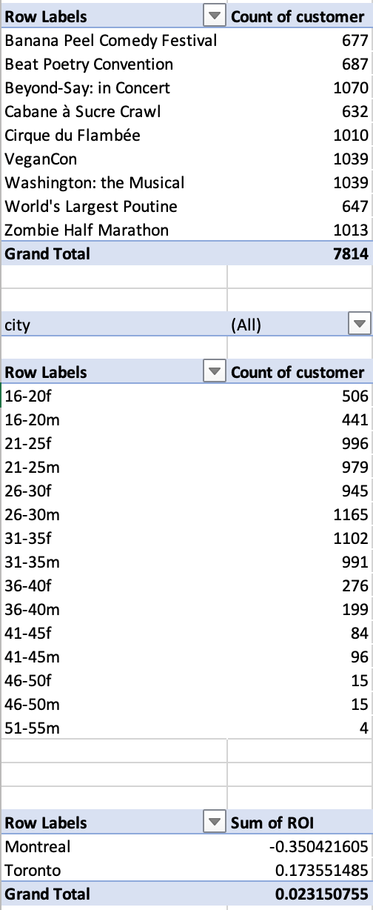

# Business Analysis Dashboard
This dashboard is created to summarize the data on the first quarter of a business.

## Preliminary Work
Before analyzing the final data, the ranges are converted into tables.

## Finding Values from Given Sheets
The values on Orders sheet; demographic, revenue per unit, device expense per unit, and event expense per unit, are created by using the given data on sales and customers.

## Pivot Table
The final values on Orders sheet are summarized by creating Pivot tables.

## Dashboard
The visualized Pivot tables are put under the sheet Dashboard to make it easier to show the results of the analysis.
